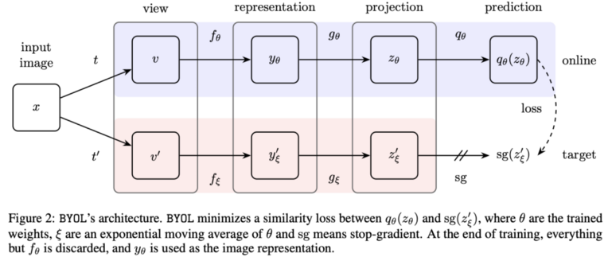

# BYOL (Bootstrap your own Latent)

## Aim - Compare accuracy of self-supervised learning vs Supervised learning algorithms in Medical imaging tasks. 
[Paper link](https://arxiv.org/abs/2006.07733)

- Area - Computer vision
- Type of algorithm - Self supervised learning
- Language - Python
- Modules - Pytorch

## Experiment Details
- Self supervised Base model used  - BYOL + ResNet50
- Supervised model for comparison  - ResNet50
- Tasks
  - 1. Radiology - Pneumonia vs  Normal chest xrays
  - 2. Skin dataset - Melanoma detection

## Datasets used

| Dataset  | Type of task | No. of classes  | No of total images | Dataset link | code |
| :---         |     :---:      | :---:      |          ---: |   ---: |---: |
|  Pneumonia | Binary classfication  |3  | 5856 | [link](https://www.kaggle.com/paultimothymooney/chest-xray-pneumonia) |  [link]() |
|  Melanoma detection | Multiclass classfication  | 5  | 44.1k | [link](https://www.kaggle.com/cdeotte/jpeg-melanoma-192x192) |  [link]() |

## Results

| Dataset  | Model 1 accuracy | Model 1 loss | Model 2 accuracy | Model 2 loss | 
| :---         |     :---:      |          ---: |   ---: |          ---: |
|  Pneumonia |   |  | | |
|  Melanoma detection | |  | | |

## Confusion matrix

## Project Directory 

